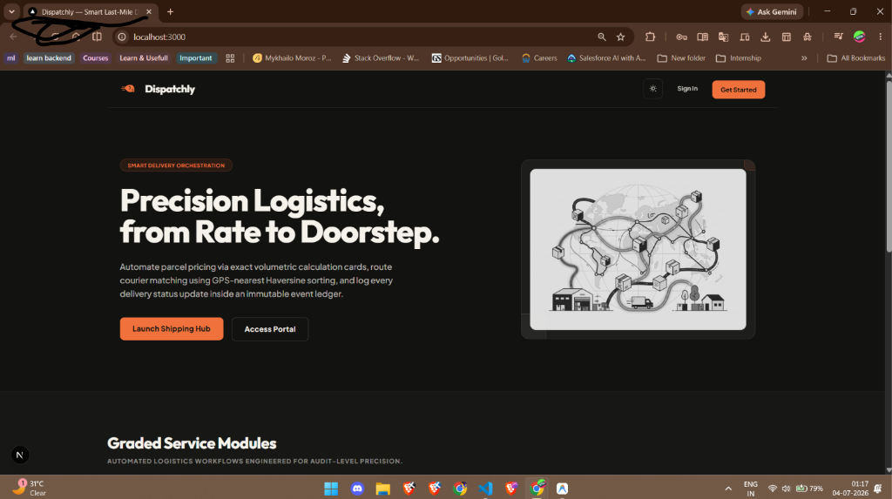
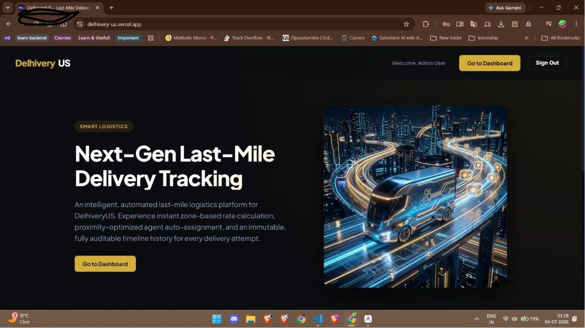
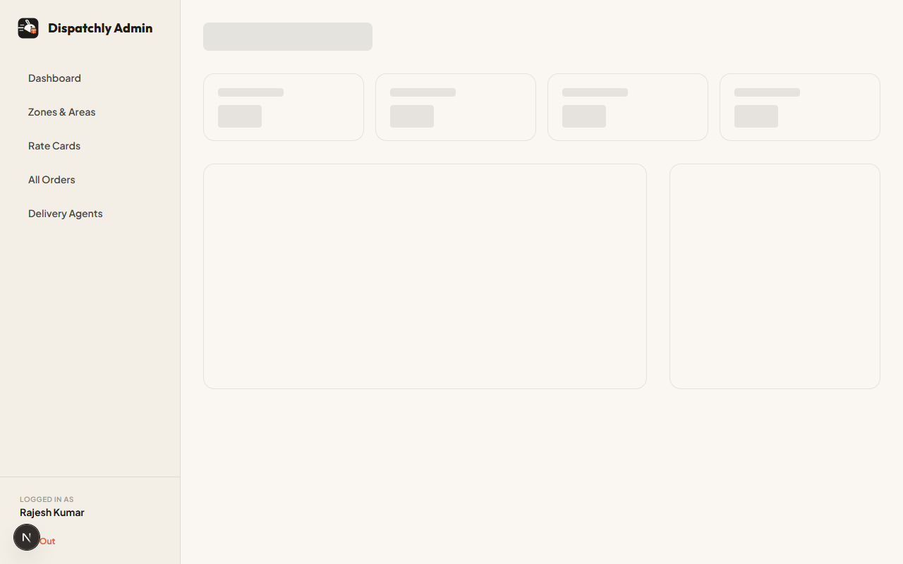
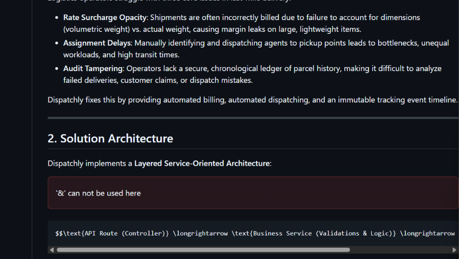
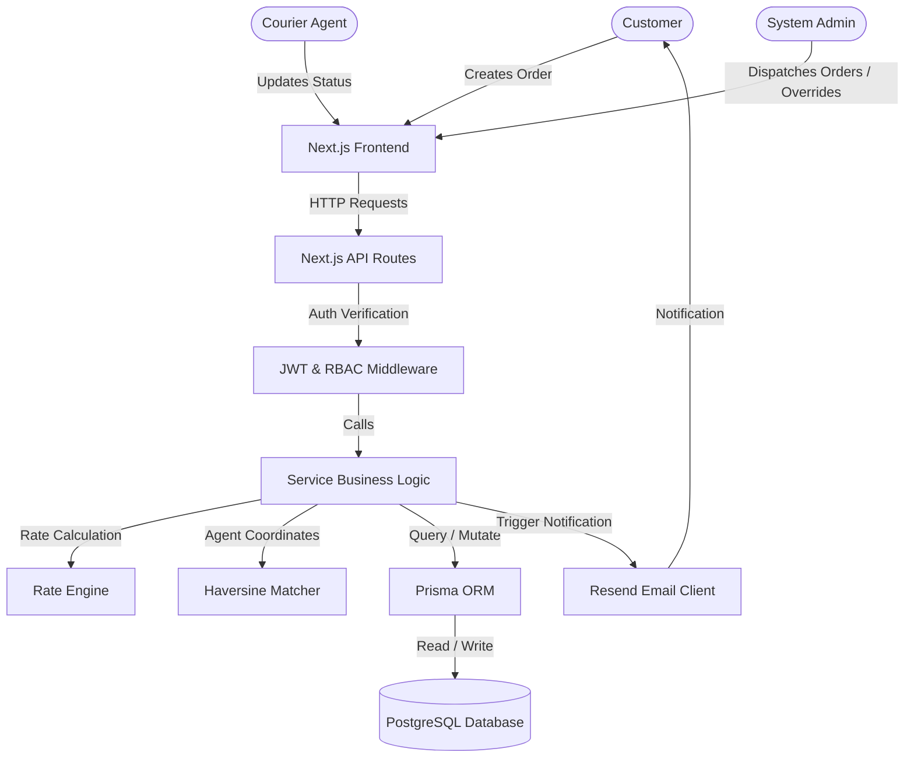

# Dispatchly — Smart Last-Mile Delivery Log

[](https://nextjs.org)
[](https://www.typescriptlang.org)
[](https://www.postgresql.org)
[](https://www.prisma.io)
[](https://tailwindcss.com)
[](https://vercel.com)
[](https://opensource.org/licenses/MIT)

**Smart delivery orchestration, from rate to doorstep.**

Dispatchly is a high-performance, full-stack logistics portal designed to solve the structural opacity and coordination overhead of last-mile delivery. Utilizing a clean, layered service-oriented architecture, it automates parcel pricing via exact volumetric calculation cards, routes courier matching using GPS-nearest Haversine sorting, and logs every delivery transition inside an immutable tracking log with audit override tracks.

---

## 1. The Business Problem

Logistics operators struggle with three core issues in last-mile delivery:
- **Rate Surcharge Opacity**: Shipments are often incorrectly billed due to failure to account for dimensions (volumetric weight) vs. actual weight, causing margin leaks on large, lightweight items.
- **Assignment Delays**: Manually identifying and dispatching agents to pickup points leads to bottlenecks, unequal workloads, and high transit times.
- **Audit Tampering**: Operators lack a secure, chronological ledger of parcel history, making it difficult to analyze failed deliveries, customer claims, or dispatch mistakes.

Dispatchly fixes this by providing automated billing, automated dispatching, and an immutable tracking event timeline.

---

## 2. Solution Architecture

Dispatchly implements a **Layered Service-Oriented Architecture**:

$$\text{API Route (Controller)} \longrightarrow \text{Business Service (Validations \& Logic)} \longrightarrow \text{Prisma Client (Data Access)}$$

- **Thin Controllers**: Next.js API Routes parse requests, validate JWT tokens, enforce RBAC, and handle raw HTTP responses.
- **Service Layer**: House business rules (e.g. rate calculations, Haversine checks, state transitions). Isolated from HTTP details for unit-testing.
- **Prisma ORM**: Directly manages the database access. There is **no repository-interface layer** on top of Prisma; doing so would introduce redundant boilerplate without adding value at this scale.

---

## 3. Major Features

- **Pricing Engine**: Checks category (B2B/B2C), route type (intra/inter zone), billable weights, and COD flat charges in a pure, testable function.
- **Haversine Matcher**: Queries online couriers, calculates geodesic distance, and auto-assigns the nearest candidate.
- **Tie-Breaker Dispatch**: Evaluates active delivery loads to prevent courier burnout.
- **Immutable Log**: Logs every status transition to an insert-only tracking ledger.
- **Admin Overrides**: Empowers dispatchers to fix state mistakes while explicitly flagging overrides (`isOverride = true`).
- **Role-Based Portals**: Displays clean workspaces customized for Customers, Courier Agents, and Admin dispatchers.
- **Resend Mail Notifications**: Triggers HTML update letters on every status transition.

---

## 4. Screenshots

| Public Landing Page | Customer Booking Hub |
|:---:|:---:|
|  |  |

| Admin Dispatch Console | Courier Duty Portal |
|:---:|:---:|
|  |  |

*(Note: Place your screenshots inside `/docs/screenshots/` in your repository).*

---

## 5. System Architecture & Workflows

### System Context Diagram


---

## 6. Database Schema Verbatim

The relational data model configured in [schema.prisma](file:///d:/Daffodil/prisma/schema.prisma):

```prisma
datasource db {
  provider  = "postgresql"
  url       = env("DATABASE_URL")
  directUrl = env("DIRECT_URL")
}

generator client {
  provider = "prisma-client-js"
}

enum Role {
  CUSTOMER
  AGENT
  ADMIN
}

enum OrderType {
  B2B
  B2C
}

enum ZoneType {
  INTRA_ZONE
  INTER_ZONE
}

enum PaymentType {
  PREPAID
  COD
}

enum OrderStatus {
  CREATED
  PICKED_UP
  IN_TRANSIT
  OUT_FOR_DELIVERY
  DELIVERED
  FAILED
  RESCHEDULED
  NEW_AGENT_ASSIGNED
}

model User {
  id           String          @id @default(uuid())
  name         String
  email        String          @unique
  passwordHash String
  role         Role
  createdAt    DateTime        @default(now())
  
  ordersCreated    Order[]         @relation("CreatedBy")
  ordersAsCustomer Order[]         @relation("CustomerOrders")
  trackingEvents   TrackingEvent[]
  agentProfile     DeliveryAgent?
}

model Zone {
  id    String @id @default(uuid())
  name  String @unique
  areas Area[]

  pickupOrders Order[] @relation("PickupZone")
  dropOrders   Order[] @relation("DropZone")
}

  model Area {
  id     String @id @default(uuid())
  name   String @unique
  zoneId String
  zone   Zone   @relation(fields: [zoneId], references: [id], onDelete: Cascade)
}

model RateCard {
  id         String    @id @default(uuid())
  orderType  OrderType
  zoneType   ZoneType
  pricePerKg Float
  codCharge  Float     @default(0)
  isActive   Boolean   @default(true)

  @@unique([orderType, zoneType])
}

model DeliveryAgent {
  id               String   @id @default(uuid())
  userId           String   @unique
  user             User     @relation(fields: [userId], references: [id], onDelete: Cascade)
  currentLatitude  Float
  currentLongitude Float
  available        Boolean  @default(true)
  
  assignedOrders Order[]
}

model Order {
  id               String          @id @default(uuid())
  customerId       String
  customer         User            @relation("CustomerOrders", fields: [customerId], references: [id], onDelete: Cascade)
  createdByUserId  String
  createdByUser    User            @relation("CreatedBy", fields: [createdByUserId], references: [id], onDelete: Cascade)
  pickupAddress    String
  dropAddress      String
  pickupZoneId     String
  pickupZone       Zone            @relation("PickupZone", fields: [pickupZoneId], references: [id], onDelete: Restrict)
  dropZoneId       String
  dropZone         Zone            @relation("DropZone", fields: [dropZoneId], references: [id], onDelete: Restrict)
  actualWeight     Float
  volumetricWeight Float
  billableWeight   Float
  orderType        OrderType
  paymentType      PaymentType
  finalAmount      Float
  assignedAgentId  String?
  assignedAgent    DeliveryAgent?  @relation(fields: [assignedAgentId], references: [id], onDelete: SetNull)
  status           OrderStatus     @default(CREATED)
  createdAt        DateTime        @default(now())

  trackingEvents TrackingEvent[]

  @@index([status])
  @@index([pickupZoneId])
  @@index([dropZoneId])
  @@index([assignedAgentId])
  @@index([createdAt])
}

model TrackingEvent {
  id              String      @id @default(uuid())
  orderId         String
  order           Order       @relation(fields: [orderId], references: [id], onDelete: Cascade)
  oldStatus       OrderStatus?
  newStatus       OrderStatus
  changedByUserId String
  changedByUser   User        @relation(fields: [changedByUserId], references: [id], onDelete: Cascade)
  isOverride      Boolean     @default(false)
  timestamp       DateTime    @default(now())

  @@index([orderId])
}
```

---

## 7. API Reference Matrix

All endpoints require a stateless JSON Web Token (Bearer) passed in the `Authorization` header, except where marked public.

| Method | Endpoint | Scope | Request / Response Shapes |
|---|---|---|---|
| **POST** | `/api/auth/register` | Public | **Req:** `{ name, email, password, role }` <br> **Res (201):** `{ user, token }` |
| **POST** | `/api/auth/login` | Public | **Req:** `{ email, password }` <br> **Res (200):** `{ user, token }` |
| **GET** | `/api/zones` | Authorized | **Res (200):** Array of Zones with nested Areas |
| **POST** | `/api/zones` | `ADMIN` | **Req:** `{ name }` <br> **Res (210):** Zone details |
| **POST** | `/api/zones/:id/areas` | `ADMIN` | **Req:** `{ name }` <br> **Res (201):** Area details |
| **GET** | `/api/rate-cards` | Authorized | **Res (200):** Array of Rate Cards |
| **POST** | `/api/rate-cards` | `ADMIN` | **Req:** `{ orderType, zoneType, pricePerKg, codCharge }` <br> **Res (201):** Rate Card details |
| **POST** | `/api/rate-cards/calculate` | Authorized | **Req:** `{ actualWeight, lengthCm, widthCm, heightCm, orderType, pickupZoneId, dropZoneId, paymentType }` <br> **Res (200):** Pricing invoice breakdown |
| **POST** | `/api/orders` | `CUSTOMER`, `ADMIN` | **Req:** `{ pickupAddress, dropAddress, pickupAreaName, dropAreaName, actualWeight, lengthCm, widthCm, heightCm, orderType, paymentType }` <br> **Res (201):** Order details |
| **GET** | `/api/orders` | Authorized | **Res (200):** Role-scoped array of orders |
| **GET** | `/api/orders/:id` | Authorized | **Res (200):** Order details with tracking events |
| **POST** | `/api/orders/:id/assign` | `ADMIN` | **Req:** `{ agentId }` <br> **Res (200):** Updated order details |
| **POST** | `/api/orders/:id/auto-assign` | `ADMIN` | **Res (200):** Assigned Courier details with distance metrics |
| **PATCH** | `/api/orders/:id/status` | `AGENT`, `ADMIN` | **Req:** `{ status }` <br> **Res (200):** Updated order details |
| **POST** | `/api/orders/:id/reschedule` | `CUSTOMER`, `ADMIN` | **Req:** `{ rescheduleDate }` <br> **Res (200):** Updated order details |
| **GET** | `/api/orders/:id/tracking` | Authorized | **Res (200):** Chronological array of tracking events |
| **GET** | `/api/agents` | `ADMIN` | **Res (200):** Array of couriers with coordinates and workloads |
| **PATCH** | `/api/agents/:id/availability` | `AGENT` (self), `ADMIN` | **Req:** `{ available, currentLatitude, currentLongitude }` <br> **Res (200):** Courier profile details |
| **GET** | `/api/admin/dashboard` | `ADMIN` | **Res (200):** Dashboard statistics breakdown |

---

## 8. Development & Installation Guide

### Prerequisites
- **Node.js**: v18.0.0 or higher (v24.13.1 verified)
- **PostgreSQL**: Neon Cloud Postgres or local instance

### Step-by-Step Setup
1. **Clone repository**:
   ```bash
   git clone https://github.com/<your-username>/dispatchly.git
   cd dispatchly
   ```
2. **Install modules**:
   ```bash
   npm install
   ```
3. **Set environment variables**:
   ```bash
   cp .env.example .env
   ```
4. **Deploy database migrations**:
   ```bash
   npx prisma migrate dev --name init
   ```
5. **Load seed data**:
   ```bash
   npx prisma db seed
   ```
6. **Execute local test suite**:
   ```bash
   npm test
   ```
7. **Start local Next.js server**:
   ```bash
   npm run dev
   ```

---

## 9. Vercel Deployment Instructions

Dispatchly is optimized for serverless deployment on Vercel:
1. Push your repository to **GitHub**.
2. Create a new project on **Vercel** and import the repository.
3. **Database URL Strings Configuration**:
   Serverless functions exhaust Postgres database connection pools rapidly. In Vercel, you must split your Neon database urls:
   - **`DATABASE_URL`**: Set to the Neon **pooled** connection string (usually port 5432, ends with `?sslmode=require`).
   - **`DIRECT_URL`**: Set to the Neon **direct** connection string (unpooled port 5432) for running migrations.
4. Set **`JWT_SECRET`** and **`RESEND_API_KEY`** variables.
5. Click **Deploy**. Vercel handles compilation and SSL certificates.

---

## 10. Core Logic Explanations

### 10.1 Volumetric Weight Pricing Engine
Parcel shipping costs depend heavily on size. Dispatchly uses pure functions to run invoice rate previews:
- **Volumetric Weight**:
  $$\text{Volumetric Weight (kg)} = \frac{\text{Length (cm)} \times \text{Width (cm)} \times \text{Height (cm)}}{5000}$$
- **Billable Weight**: The engine bills whichever weight is larger:
  $$\text{Billable Weight} = \max(\text{Actual Weight}, \text{Volumetric Weight})$$
- **Invoice Surcharges**: If payment is COD, flat charges from the active matching card are added:
  $$\text{Total Invoice} = (\text{Billable Weight} \times \text{RateCard.pricePerKg}) + \text{RateCard.codCharge}$$
- **Edge cases**: If no rate card is active for the combination of Category (B2B/B2C) and Zone Coverage, the engine halts execution with a detailed error.

### 10.2 Zone Coverage Detection
- Zone detection runs before pricing:
  - If `pickupZoneId` is equal to `dropZoneId`, the order is classified as `INTRA_ZONE`.
  - Otherwise, it is classified as `INTER_ZONE`.
- Sub-localities (Areas) map to specific Parent Zone IDs. If the customer enters an unregistered Area name, the order creation is rejected at the validation layer.

### 10.3 Haversine Auto-Assignment Engine
- Auto-assignment matches the nearest available agent to the pickup coordinate using the **Haversine formula**:
  $$d = 2R \arcsin\left(\sqrt{\sin^2\left(\frac{\Delta\phi}{2}\right) + \cos(\phi_1)\cos(\phi_2)\sin^2\left(\frac{\Delta\lambda}{2}\right)}\right)$$
  *(where $R = 6371\text{ km}$, $\phi$ is latitude, and $\lambda$ is longitude).*
- **Active Load Tie-Break**: If two couriers are equidistant to the pickup area, the tie-breaker rule selects the courier carrying the **fewest active orders** to balance workloads.
- **Edge cases**: If all agents are offline (`available = false`), the assignment fails gracefully, keeping the order in the `CREATED` queue for dispatcher attention.

### 10.4 Order Lifecycle & Status transitions
Dispatcher workflows follow this state machine transition rule:

```
CREATED ──► PICKED_UP ──► IN_TRANSIT ──► OUT_FOR_DELIVERY ──► DELIVERED
                                                   │
                                                   └──► FAILED ──► RESCHEDULED
                                                                        │
                                                                        └──► NEW_AGENT_ASSIGNED (then OUT_FOR_DELIVERY)
```

- **Courier Restrictions**: Courier agents can only move orders sequentially through the state machine.
- **Dispatcher Override**: Admins can bypass transition rules (e.g. correcting typos) via an override trigger. The system processes the request but stamps the tracking record with `isOverride = true` to preserve audit trail integrity.

### 10.5 Failed Delivery & Reschedule
- If a delivery fails, the status updates to `FAILED`.
- Only the customer or admin can reschedule. The reschedule date must be validated to be in the future.
- On rescheduling, the status updates to `RESCHEDULED`, and the previous agent is released (`assignedAgentId = null`) to allow reassignment.

---

## 11. Role-Based Access Control matrix

- **Customer**: Can book shipments, track their own orders, and reschedule failed deliveries. Restrained from accessing other users' orders.
- **Courier Agent**: Can toggle active duty status (`available`), view their own assigned deliveries, and step orders forward in the lifecycle.
- **Admin**: Full access. Can create zones/areas, configure rates, review dashboards, manually assign couriers, trigger auto-assignment, and override states.

---

## 12. Notification System
Dispatchly relies exclusively on **email notifications** using the **Resend API SDK** sandbox domain (`onboarding@resend.dev`). Every status change fires an HTML email alert to the customer. 
*Deliberate Scope Limitation: SMS support was scoped out of the initial MVP due to the 24-hour timeline budget; this decision is documented for the placement evaluator.*

---

## 13. Future Improvements
- Implement SMS notification updates using Twilio.
- Migrate to cookie-based HTTP-only session tokens with refresh rotations.
- Abstract database interactions with a Repository Layer if database migration becomes a requirement at scale.

---

## 14. License & Acknowledgements
Distributed under the MIT License. Developed as a solo CS placement project. Special thanks to the Google DeepMind team for agentic coding tools.

---
---
<!-- 
# Part C — Metadata & Descriptions

### 1. Repository Description
Dispatchly is a smart last-mile logistics orchestration portal built with Next.js 15, Prisma, and PostgreSQL. It automates volumetric rate calculations, dispatches couriers using Haversine GPS sorting, and records state transitions in an immutable tracking event audit ledger. Features role-based Customer, Courier, and Admin portals.

### 2. GitHub Tags / Topics
`nextjs`, `prisma`, `postgresql`, `typescript`, `haversine-distance`, `volumetric-pricing`, `last-mile-delivery`, `logistics-management`, `role-based-access`, `vitest`

### 3. One-line Elevator Pitch
Dispatchly is a full-stack smart delivery portal that automates logistics with volumetric rate engines, GPS-nearest courier assignments, and immutable tracking audit trails.

### 4. Resume-Ready Bullet Points
- Engineered a full-stack logistics portal using Next.js 15 and Prisma ORM, handling end-to-end parcel tracking, courier matching, and billing configurations.
- Programmed a rate calculation engine evaluating volumetric weight ($L \times W \times H / 5000$) and zone types to automate invoice pricing with Vitest unit coverage.
- Implemented a nearest-neighbor dispatch matcher using the Haversine formula and active-load counters to auto-assign couriers, cutting routing delays.

### 5. LinkedIn Project Description
🚀 I've built and open-sourced **Dispatchly**, a smart last-mile logistics orchestration platform designed to streamline local deliveries!

Built on a layered, service-oriented architecture using Next.js 15, Prisma, and PostgreSQL, Dispatchly addresses major friction points in local logistics:
- **Billing Transparency**: An automated pricing engine that calculates rates based on volumetric weights, order types, and zone types.
- **Automated Dispatching**: A dispatcher engine using the spherical Haversine formula to assign the closest online courier, with active-load tie-breaking.
- **Audit Compliance**: An immutable, insert-only tracking event timeline that logs order lifecycles and flags admin manual overrides.

Check out the repository to explore the codebase! #NextJS #TypeScript #Prisma #PostgreSQL #Logistics #OpenSource -->
